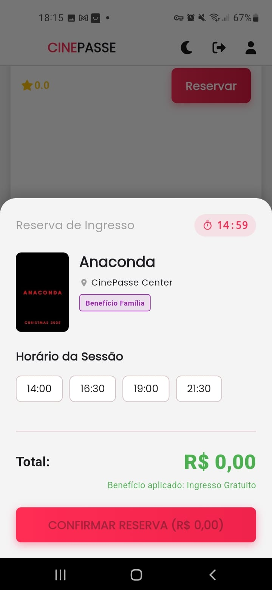
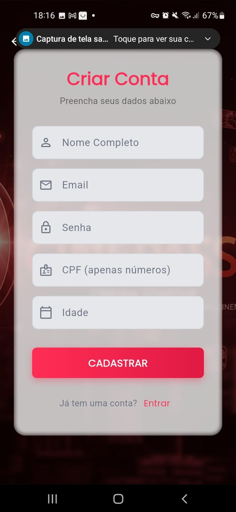
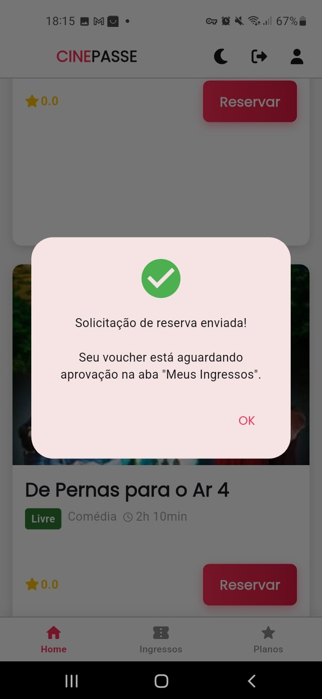
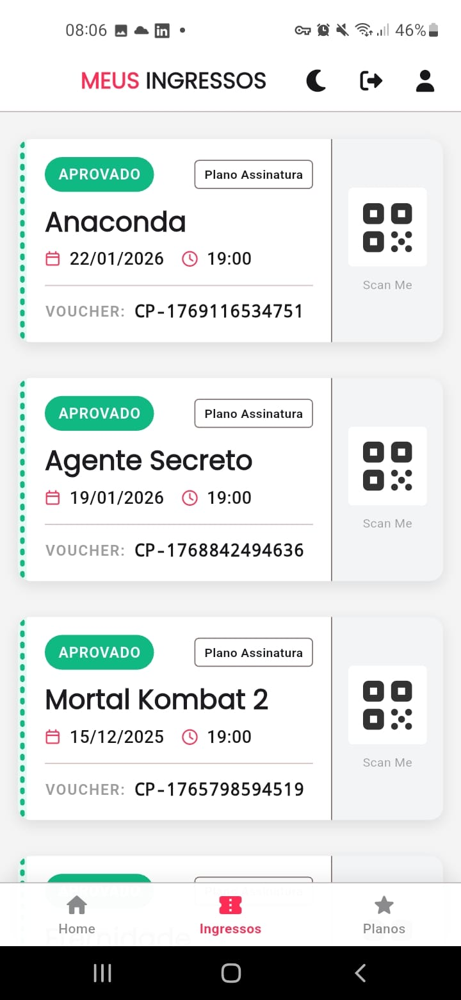
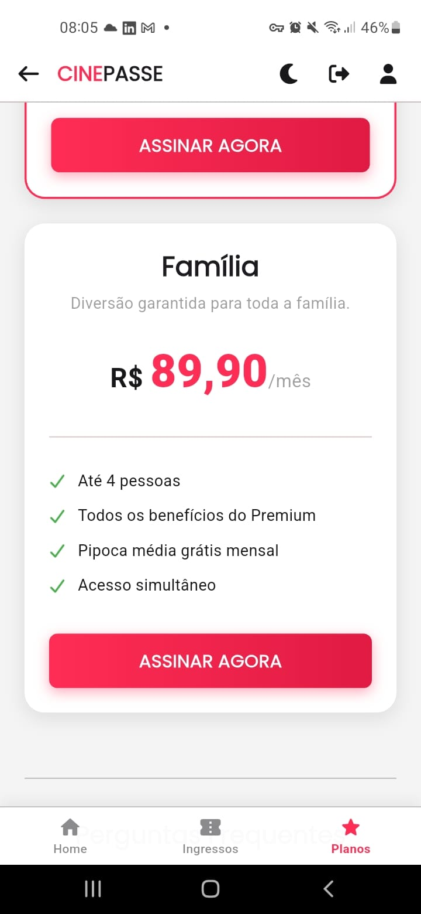
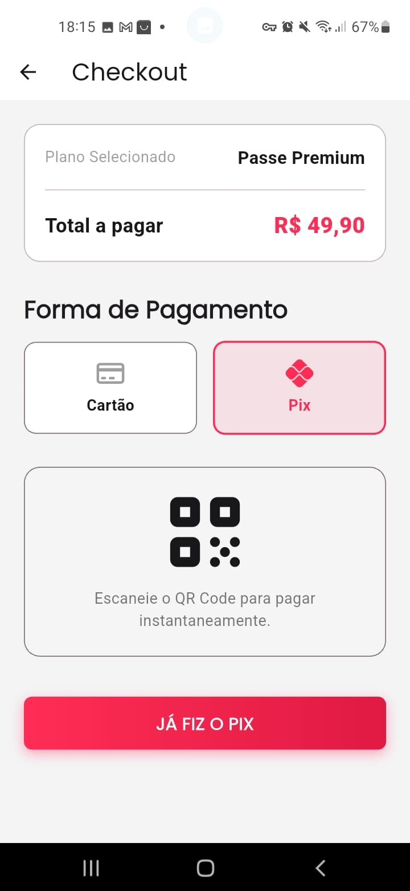
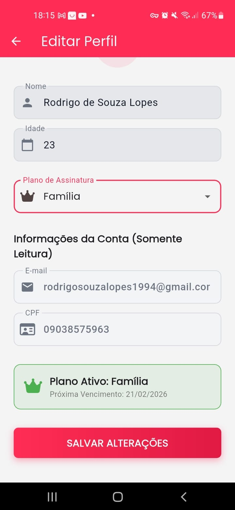
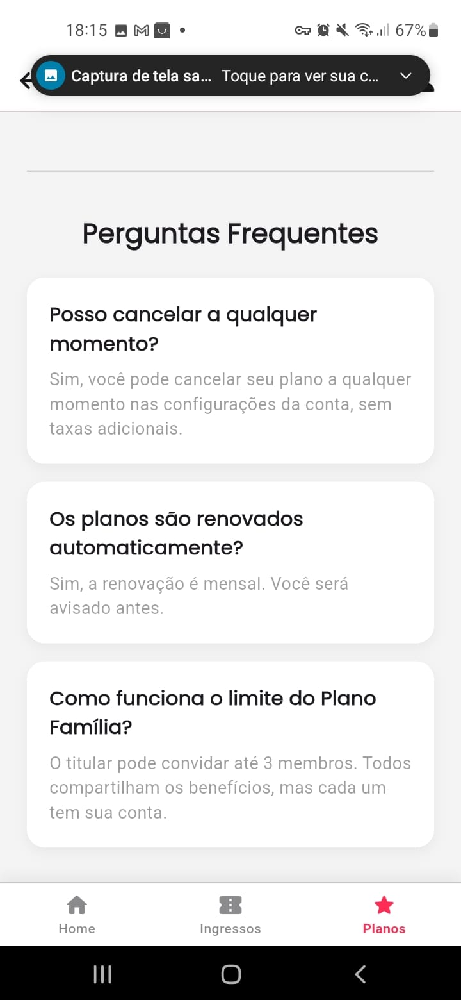

# 🎬 CinePasse – Documentação de Lançamento

## 📌 Visão Geral

O **CinePasse** é uma plataforma de assinatura de ingressos de cinema composta por um **Aplicativo Mobile (Flutter)** e um **Painel Administrativo Web (React)**, utilizando **Firebase/Firestore** como backend.

O objetivo do sistema é oferecer uma experiência simples e moderna para o usuário final, ao mesmo tempo em que garante **controle total das regras de negócio via Backoffice**, assegurando integridade, segurança e eficiência operacional.

---

## 🧠 Modelo de Negócio – Assinaturas (Coração do App)

O CinePasse opera por meio de **planos de assinatura**, que definem automaticamente os benefícios do usuário no momento da reserva de ingressos.

### 📦 Planos Disponíveis

| Plano                 | Preço (Exemplo) | Benefício na Reserva        | Regra de Uso                                            |
| --------------------- | --------------- | --------------------------- | ------------------------------------------------------- |
| **Passe Premium**     | R$ 49,90/mês    | Ingresso gratuito           | Válido apenas para o titular, **1 ingresso por sessão** |
| **Plano Família**     | R$ 89,90/mês    | Ingresso gratuito           | Titular + até **3 membros adicionais** (4 usuários)     |
| **Básico (Gratuito)** | R$ 0,00         | Pagamento avulso (R$ 25,00) | Sem limite de uso, pagamento por reserva                |

---

### 🔁 Fluxo de Reserva de Ingressos (Regra Crítica)

Independentemente do plano, **todo ingresso passa por validação do Backoffice**, garantindo controle total dos assentos:

1. **Reserva (App Mobile)**
   O usuário escolhe o filme, horário e ticket conforme seu plano. O ingresso é criado com status **"Pendente"**.

2. **Validação (Backoffice)**
   O painel administrativo recebe a solicitação em tempo real e valida:

   * Plano ativo e limites
   * Ou confirmação de pagamento avulso

3. **Aprovação**
   O Admin altera o status para **"Aprovado"**.

4. **Voucher Liberado**
   O ingresso aprovado aparece instantaneamente na aba **"Meus Ingressos"** do usuário.

---

## 📱 Aplicativo Mobile (Flutter) – Experiência do Usuário

O aplicativo foi desenvolvido priorizando **usabilidade, velocidade e clareza**, permitindo que o usuário controle toda sua jornada.

### 🔐 Acesso e Perfil

| Funcionalidade    | Descrição                                       | Observações                                           |
| ----------------- | ----------------------------------------------- | ----------------------------------------------------- |
| Login / Cadastro  | Autenticação segura via Firebase Authentication | Dados complementares (CPF, idade) salvos no Firestore |
| Edição de Perfil  | Alterar nome e idade                            | CPF e e-mail são somente leitura                      |
| Assinaturas       | Visualização e contratação de planos            | Benefícios aplicados automaticamente                  |
| Tema Claro/Escuro | Alternância manual de tema                      | Preferência salva localmente                          |

---

### 🎥 Conteúdo e Ingressos

| Funcionalidade     | Descrição                           | Funcionamento                                |
| ------------------ | ----------------------------------- | -------------------------------------------- |
| Catálogo de Filmes | Lista de filmes em cartaz           | Dados em tempo real via Streams do Firestore |
| Reserva com Timer  | Cronômetro de 5 minutos por reserva | Evita bloqueio indevido de assentos          |
| Meus Ingressos     | Visualização de vouchers            | Apenas ingressos **Aprovados** são exibidos  |

---

## 🖥️ Painel Administrativo (React) – Backoffice

O Backoffice é responsável por **validar tickets, gerenciar usuários e manter o catálogo atualizado**.

### 🔑 Governança e Segurança

| Módulo             | Função                                | Segurança                              |
| ------------------ | ------------------------------------- | -------------------------------------- |
| Login Admin        | Acesso exclusivo para administradores | Flag `isAdmin: true` + Firestore Rules |
| Dashboard          | Métricas em tempo real                | Apoio à tomada de decisão              |
| Gestão de Usuários | Consulta e alteração de planos        | Suporte e resolução de problemas       |

---

### 🎟️ Tickets e Catálogo

| Módulo               | Ação                                   | Benefício                    |
| -------------------- | -------------------------------------- | ---------------------------- |
| Validação de Tickets | Aprovar ou rejeitar reservas pendentes | Voucher liberado em segundos |
| Catálogo de Filmes   | Criar, editar e excluir filmes         | Atualização imediata no App  |

---

## 🔒 Segurança e Integridade do Sistema

* **Chaves SHA-1 registradas no Firebase**
  Garante funcionamento correto de login e serviços após publicação na Play Store.

* **Regras de Segurança do Firestore**

  * Usuários **não podem criar tickets aprovados**
  * Apenas Admin pode alterar status de tickets
  * Apenas Admin pode gerenciar catálogo

Esse modelo elimina fraudes e garante validação centralizada.

---

## 🖼️ Screenshots do Aplicativo

> As imagens abaixo representam a experiência real do usuário no CinePasse.

### 📱 Telas do App Mobile

#### 🔐 Autenticação

#### 🏠 Navegação e Conteúdo

#### 💳 Planos e Pagamentos

#### 👤 Perfil e Preferências

#### ℹ️ Suporte

---

## ✅ Conclusão

O **CinePasse** entrega um ecossistema completo e escalável, unindo:

* Experiência fluida para o usuário
* Controle rigoroso das regras de negócio
* Atualizações em tempo real
* Segurança de nível produção

Ideal para operações de cinema baseadas em **assinatura e validação centralizada**.
